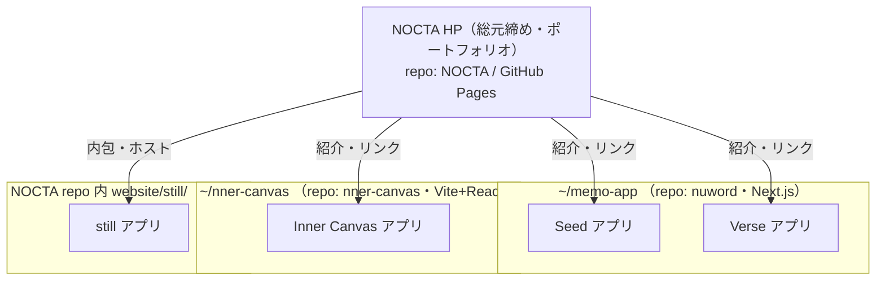
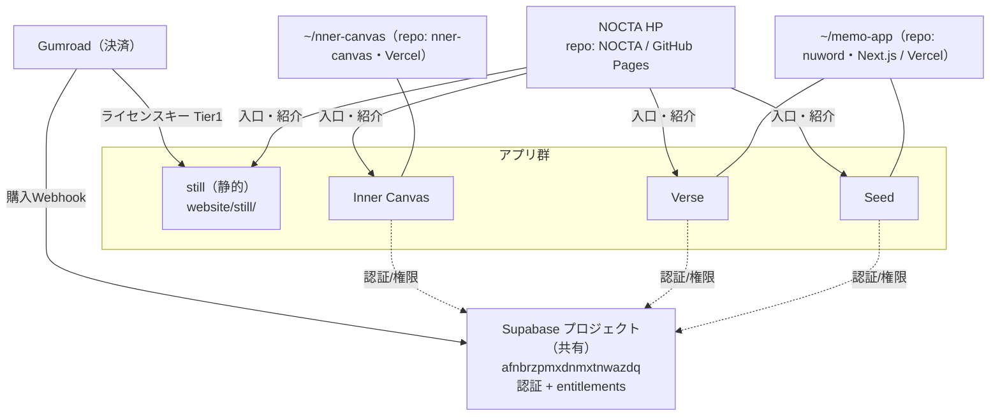

# NOCTA とアプリ群の関係図

NOCTA（ランディングページ／ポートフォリオの総元締め）と、各ディレクトリ／リポジトリで
作っているアプリの関係を図示する。誰でも全体像を把握できるようにするための資料。
最終更新: 2026-06-16

---

## 名前の対応（CEOの呼び名 → 正式名）

| CEOの呼び名 | 正式名 | ディレクトリ / リポジトリ | ホスティング | 含むアプリ |
|---|---|---|---|---|
| New World（MemoUp） | NuWord / memo-app | `~/memo-app`（repo: nuword） | Vercel（nuword-nu.vercel.app） | Seed・Verse（2アプリ） |
| Inner Campus | Inner Canvas | `~/nner-canvas`（repo: nner-canvas） | Vercel（nner-canvas.vercel.app） | Inner Canvas |
| Stell | still | NOCTA repo内 `website/still/` | GitHub Pages | still |

補足: still は独立リポジトリではなく **NOCTA HP 本体の一部**（`website/still/`）。

---

## 図1: ディレクトリ／リポジトリ と アプリの関係（基本）



要点:
- **NOCTA HP** が全アプリを「紹介・入口」としてまとめる総元締め。
- **memo-app（nuword）** は1つのコードベースで **Seed と Verse の2アプリ** を提供。
- **nner-canvas** は **Inner Canvas** 単独。
- **still** は NOCTA HP の中（website/still/）に同居。

---

## 図2: 共有インフラと収益化を重ねた全体像（詳細）



要点:
- **Seed・Verse・Inner Canvas は同一の Supabase プロジェクトを共有**（認証＋購入権限 entitlements）。
- **収益化は2系統**:
  - still = Gumroad のライセンスキーをクライアント照合（Tier1・Supabase不要）
  - Vercel系3アプリ = Gumroad購入 → Webhook → 共有Supabaseの entitlements（all-access）
- 詳細は `drafts/monetization-kit/MONETIZATION-STATUS.md` を参照。

---

## 図3: プレーンテキスト版（Mermaid非対応ビューア用）

```
NOCTA HP（総元締め・GitHub Pages / repo: NOCTA）
│  各アプリを紹介・リンクする入口
│
├─ website/still/ …………… still（静的・NOCTA内に同居）   ── 課金: Gumroadキー(Tier1)
│
├─ ~/memo-app（repo: nuword・Next.js / Vercel）
│     ├─ Seed                                            ┐
│     └─ Verse                                           │ 課金: Gumroad→Webhook
│                                                        │      →共有Supabase権限
└─ ~/nner-canvas（repo: nner-canvas / Vercel）            │
      └─ Inner Canvas                                    ┘
                          ↑
        Seed / Verse / Inner Canvas は
        同一Supabaseプロジェクト（認証＋権限）を共有
```
